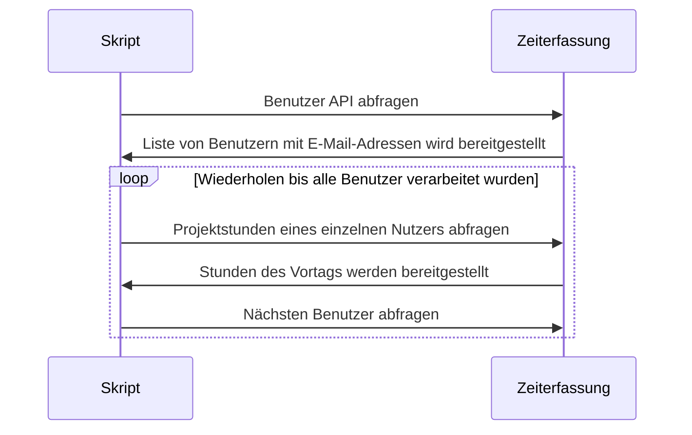

```mermaid
sequenceDiagram
    participant S as Skript
    participant Z as Zeiterfassung
    S->>Z: Benutzer API abfragen
    Z->>S: Liste von Benutzern mit E-Mail-Adressen wird bereitgestellt
    loop Wiederholen bis alle Benutzer verarbeitet wurden
    S->>Z: Projektstunden eines einzelnen Nutzers abfragen
    Z->>S: Stunden des Vortags werden bereitgestellt
    #Note left of S: Stunden verarbeiten und E-Mail senden wenn Stunden nicht eingetragen wurden
    S->>Z: Nächsten Benutzer abfragen
    end

```